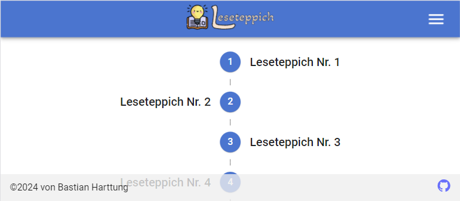
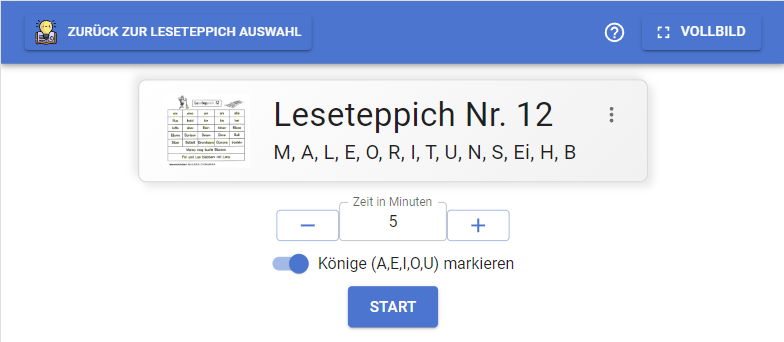
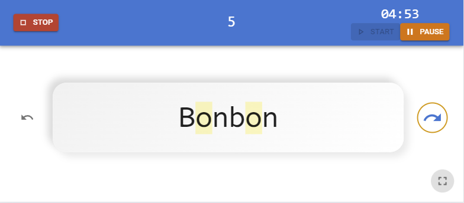

# Leseteppich

Eine Web-App, konzipiert für das Handy, um den Leseteppich für Erstklässsler etwas spannender zu gestalten und mit einem
Punktesystem interessanter für Kinder zu machen.

Demo: https://www.leseteppich.de

## So funktionierts

#### Startseite:

\
Hier kannst du den Leseteppich wählen, beginnend oben bei Nr. 1.\
Außerdem gibt es eine Hilfe und ein Impressum im Header Menü.

#### Teppich:

\
Das ist der Detailbildschirm für einen Leseteppich.\
Den Highscore vom Teppich kann man über die 3 Punkte erreichen.\
Man kann die Zeit zum Lesen einstellen. Die Königsmarkierung ein- oder ausstellen.\
Es gibt eine Hilfe und die Möglichkeit den Vollbildschirm einzustellen im Header.\
Am Ende kann das Spiel gestartet werden.

#### Spiel:

\
Der Timer startet sofort nach dem Start. Er kann aber pausiert werden.\
Die Wörterkarten können mit den Pfeilen oder mit swipen vor und zurück gemacht werden.\
Oben werden die Punkte gezählt.\
Rechts unten kann der Vollbildschirm auch hier eingestellt werden.
Das Spiel wird mit Stop beendet und geht zurück zum Teppich

Ansonsten einfach mal ausprobieren :)\
Ich hoffe ihr habt Spaß beim Ausprobieren und es hilft eurem Kind beim lesen Lernen.

____________________________

## Technologien

- React (Vite)
- Typescript
- Zustand
- Material UI

## React + Vite + Typescript

This template provides a minimal setup to get React working in Vite with HMR and some ESLint rules.

Currently, two official plugins are available:

- [@vitejs/plugin-react](https://github.com/vitejs/vite-plugin-react/blob/main/packages/plugin-react/README.md)
  uses [Babel](https://babeljs.io/) for Fast Refresh
- [@vitejs/plugin-react-swc](https://github.com/vitejs/vite-plugin-react-swc) uses [SWC](https://swc.rs/) for Fast
  Refresh

## Expanding the ESLint configuration

If you are developing a production application, we recommend updating the configuration to enable type aware lint rules:

- Configure the top-level `parserOptions` property like this:

```js
export default {
  // other rules...
  parserOptions: {
    ecmaVersion: 'latest',
    sourceType: 'module',
    project: ['./tsconfig.json', './tsconfig.node.json'],
    tsconfigRootDir: __dirname,
  },
}
```

- Replace `plugin:@typescript-eslint/recommended` to `plugin:@typescript-eslint/recommended-type-checked`
  or `plugin:@typescript-eslint/strict-type-checked`
- Optionally add `plugin:@typescript-eslint/stylistic-type-checked`
- Install [eslint-plugin-react](https://github.com/jsx-eslint/eslint-plugin-react) and
  add `plugin:react/recommended` & `plugin:react/jsx-runtime` to the `extends` list

### Start Project

`vite dev`

### Build Project

`vite build`